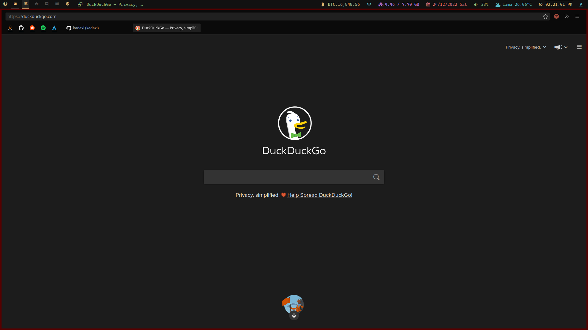

# 🦊 Firefox minimal.

A minimalistic theme made for Firefox, dark palette based and key centered. If you want to contribute can do by modifiying `userChrome.css` file, for css tags you must debug your browser making use of `Ctrl + Alt + Shift + I`.

## Installation
1. Clone this repo with `git clone https://github.com/kadaxi/firefox-minimal-theme.git`.
2. Enter in firefox and search at the top bar for `about:support`.
3. In the config accept the risk if asked. Search the following path `Application Basics > Profile Directory > Open Directory`.
4. Move `firefox-minimal-theme/chrome/userChrome.css` inside previous path.
5. Restart firefox, and be familiar with the keys.

If you want to uninstall the theme, just must remove `chrome` folder and restart.

## Shorcuts
For the common situations exists shorcuts for be most productive than making use of mouse. If we consider few:
1. Open new tab: `Ctrl + T`.
2. Close tab: `Ctrl + W`.
3. Bookmarks: `Ctrl + Shift + B`.
4. Previus page: `Alt + Left arrow`.
5. Next page: `Alt + Right arrow`.
6. Recharge: `Ctrl + R`.
7. Change next tab: `Ctrl + Tab`.
8. Change previous tab `Ctrl + Shift + Tab`.
